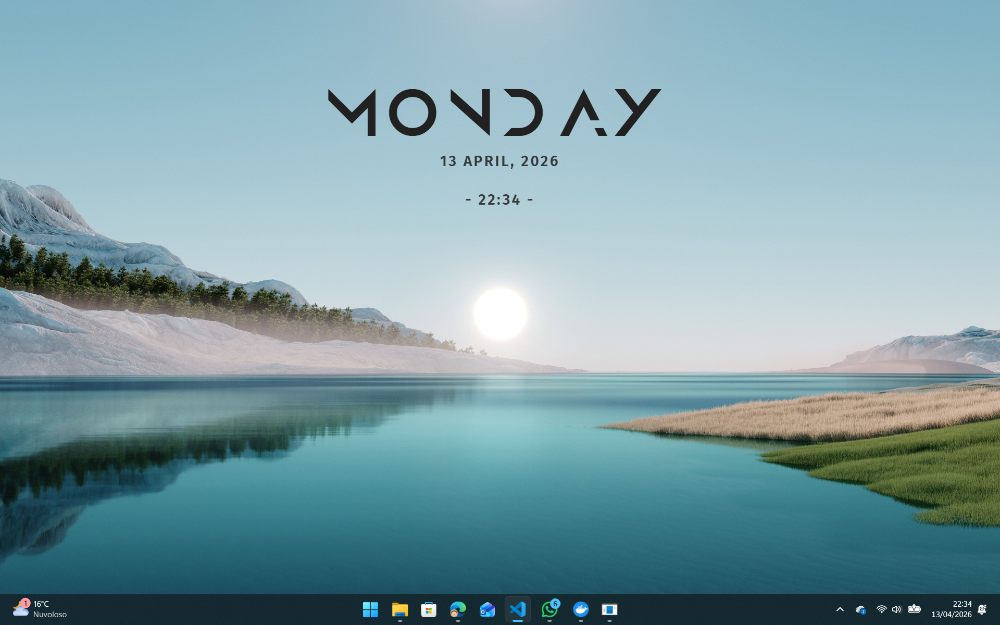

# vitrine-mond

A theme for [Vitrine](https://github.com/felixstrobel/vitrine), inspired by [Mond](https://visualskins.com/skin/mond), a theme for [Rainmeter](https://www.rainmeter.net/).



## Features

- Clock with date, weekday, month and year

## Build

```sh
make install   # install dependencies (runs inside Docker, Node 20)
make build     # produce dist/ (runs inside Docker, Node 20)
```

Requires Docker.
